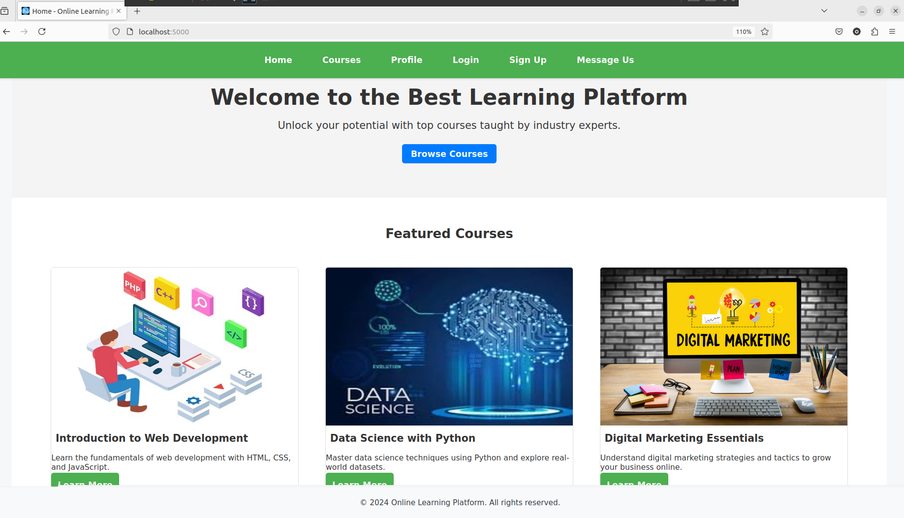
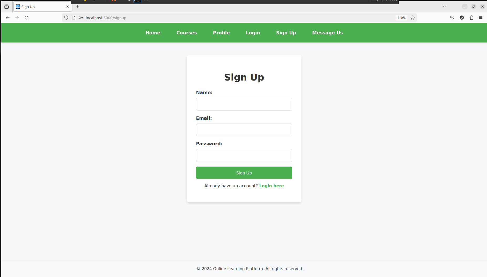
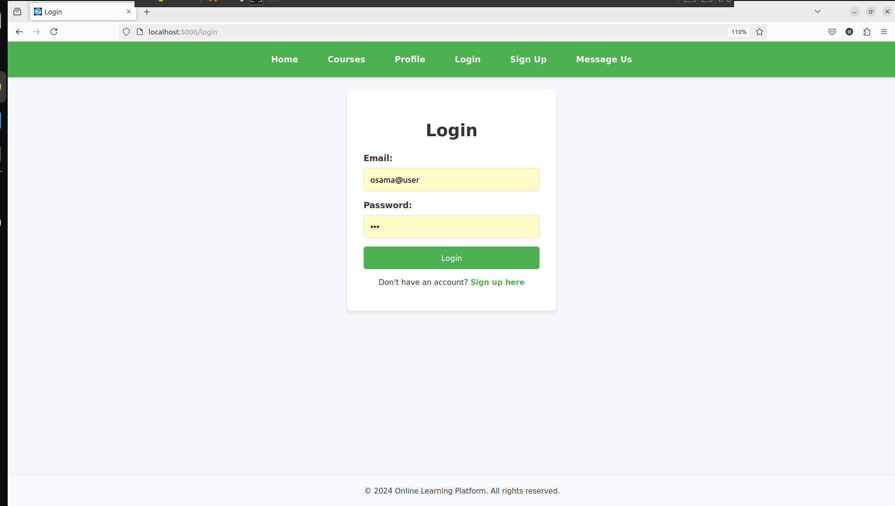
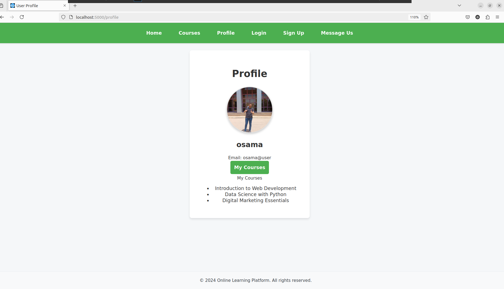
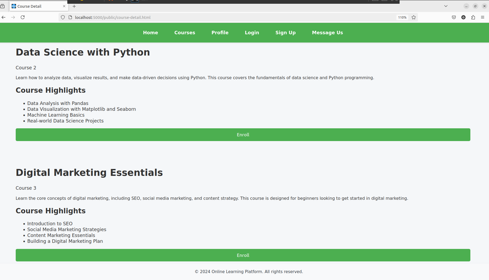
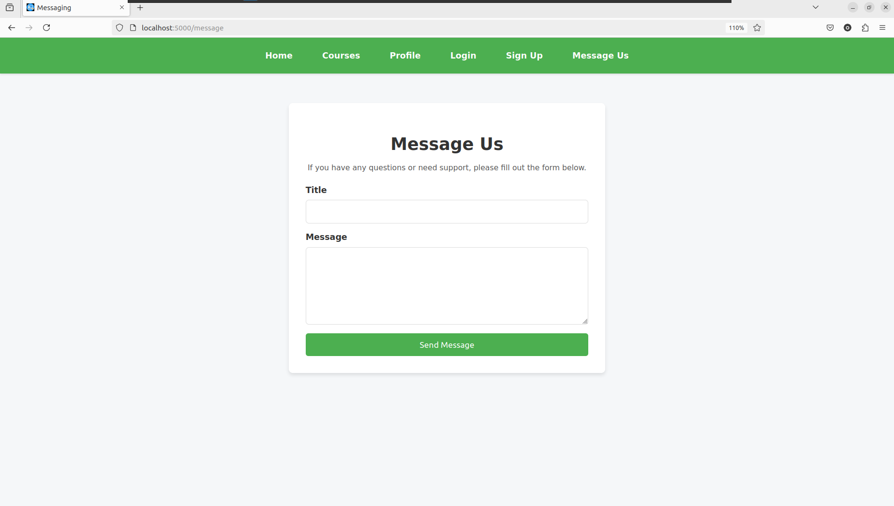

# 🎓 CollegeTraining-Final-Project

# 🌟 Online Learning Platform

Welcome to the **Online Learning Platform** project repository. This project was developed as part of our final college training project, aiming to create a modern, user-friendly online learning environment.

## 🚀 Project Overview

The **Online Learning Platform** is designed to provide a seamless and engaging learning experience for users. Built with a focus on scalability and user-centric design, the platform offers a wide range of features to enhance online education.

## 🛠️ Key Technologies

- **Backend:** Node.js, Express
- **Frontend:** HTML, CSS, JavaScript
- **Database:** MySQL

## 🎯 Features

1. **Home Page**
   - A welcoming landing page that introduces users to the platform's offerings.

2. **User Authentication**
   - Secure login and signup processes tailored for new and returning users.

3. **User Profiles**
   - Personalized profiles for tracking progress and managing course enrollments.

4. **Support Channel**
   - A direct messaging feature to facilitate user inquiries and support.

5. **Course Catalog**
   - A comprehensive collection of educational courses across various disciplines.

6. **Detailed Course Pages**
   - In-depth information on each course, including curriculum details, instructor bios, and user reviews.

## 📚 How to Run the Project

1. **Clone the Repository:**
   ```bash
   git clone https://github.com/yourusername/online-learning-platform.git
2. Navigate to the Project Directory:
   ```bash
   cd online-learning-platform
3. Install Dependencies:
   ```bash
   npm install
4. Set Up the Database:
   Import the provided SQL file into your MySQL server.
   Configure the database connection in the config.js file.
   
6. Run the Application:
    ```bash
    npm start
7. Access the Platform:
   Open your web browser and navigate to http://localhost:3000.


<br/>
<br/>
👥 Team Contributions
Backend Development:  - Developed the server-side using Node.js and Express, ensuring efficient and secure application functionality.
Frontend Development:  - Designed a responsive and engaging user interface, prioritizing ease of use and accessibility.
Database Management:   - Implemented a robust MySQL data structure, ensuring data integrity and optimized performance.

<br/>
<br/>
<br/>
📷 Screenshots
Here are some screenshots from the platform:

Home Page <br/>
 <br/>

User Authentication  <br/>
 <br/>
 <br/>

User Profiles  <br/>
 <br/>

Course Catalog  <br/>
  <br/>

Support Channel  <br/>
  <br/>

<br/>
🔗 Links
Project Repository: 

<br/>
<br/>
<br/>

<br/>
📄 License
This project is licensed under the MIT License - see the LICENSE file for details.


